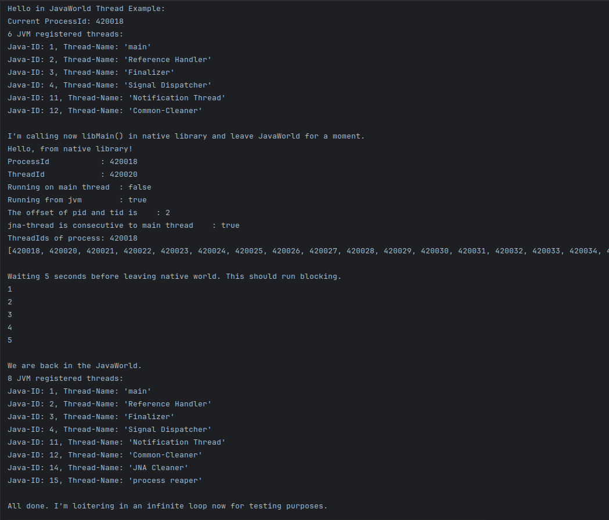

This project has the purpose of examine the differences between rust main thread when a native library was loaded via jna.

The library and bindings are build with the help of my own toolchain.
The cargo-uniffi-gradle plugin is in beta state and not yet published.
I put, quick and dirty, a fat jar, here.
Sorry for the inconveniences.

However, the examples should run under x86_64_linux without the necessity
of (re)building the rust library and (re)generating the bindings.

If curious to build, uncomment and consider the new tasks in task group "rust",
such as "buildLibraries".
The sample executable binary build is not covered by the plugin
and must be built via command line "cargo build" in app/rust.

Configuration is done in extension cargoUniffi {}
For transparency I mentioned the default options due to lack of docs for the plugin.

jna developers should be interested in
src/main/kotlin/uniffi/example_library/example_library.kt
where all jna library loading magic happens.

In a terminal you can additionaly examine PID and TID with command like this:

(sudo) /usr/lib/jvm/java-17-openjdk-amd64/bin/jhsdb clhsdb --pid 123456
hsdb> threads

There is a related google discussion with some useful insights and conclusions:

[https://groups.google.com/g/jna-users/c/OvSWRSiYmZo](https://groups.google.com/g/jna-users/c/OvSWRSiYmZo)

After running the application you should see something like this:

